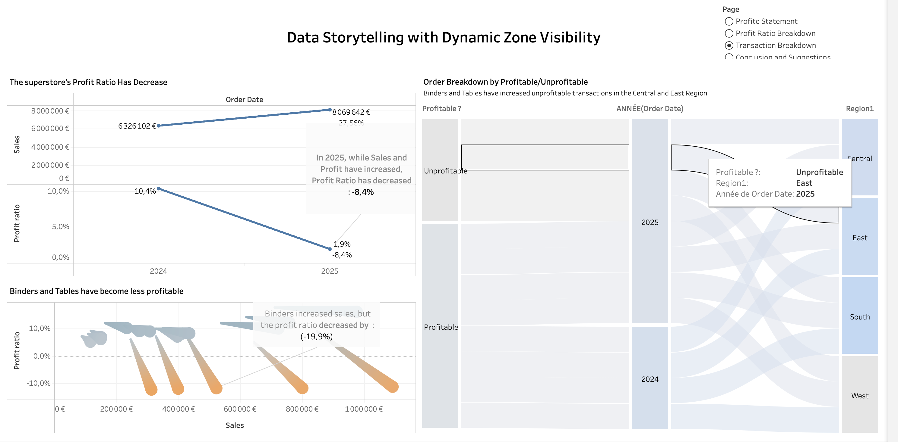

# Margin Focus: At-Risk Sub-Categories 2024–2025

This project analyzes the evolution of profitability ratio between 2024 and 2025. It highlights at-risk sub-categories such as Binders and Tables, which show increased sales but declining margins. The analysis also reveals regional disparities (Central, East, South, West) to help guide strategic business decisions.

- Dashboard: https://public.tableau.com/app/profile/razdine.said/viz/MarginFocusAt-RiskSub-Categories20242025/Tableaudebord1?publish=yes

## Dashboard Preview



## Files
- Margin Focus_ At-Risk Sub-Categories 2024–2025.twbx: Tableau workbook package.

## Procedure: get the file from GitHub and open it in Tableau

- **Option 1 — Download (simplest)**
  1. Open the GitHub repository page.
  2. Click `Code` > `Download ZIP`.
  3. Unzip; you will see the `.twbx` file.

- **Option 2 — Clone the repository (recommended if you will republish)**
  1. Copy the repository HTTPS URL.
  2. In Terminal:

```bash
cd "/Users/razdinesaid/Desktop"
git clone https://github.com/<your-username>/margin-focus-at-risk-sub-categories-2024-2025.git
cd margin-focus-at-risk-sub-categories-2024-2025
```

- **Open in Tableau Desktop / Tableau Public (desktop app)**
  - Double-click the `.twbx` file OR open Tableau > `File` > `Open` and select the file.
  - The `.twbx` packages data sources; you can edit sheets, dashboards, and calculations.
  - To publish: `File` > `Save to Tableau Public As…`, then add title/description.

- **Open via Tableau Public (web)**
  1. Sign in to Tableau Public.
  2. `Create` > `Upload a workbook`.
  3. Select the `.twbx`, then click `Edit` to work in the browser.
  4. Save; the dashboard will be available on your profile.

- **Push your changes back to GitHub (if you cloned)**

```bash
git add "Margin Focus_ At-Risk Sub-Categories 2024–2025.twbx"
git commit -m "Update workbook"
git push
```

- **Notes**
  - If the `.twbx` > 100 MB, use Git LFS or reduce the workbook size.
  - If some connections are live, ensure they are packaged or reconnect them after opening.
